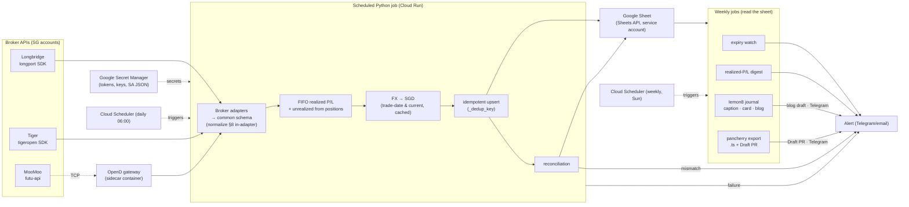
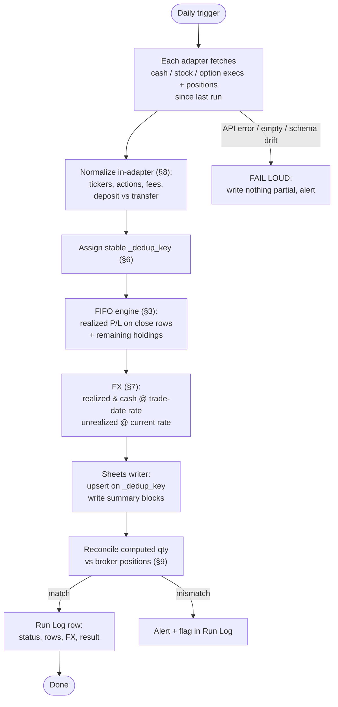
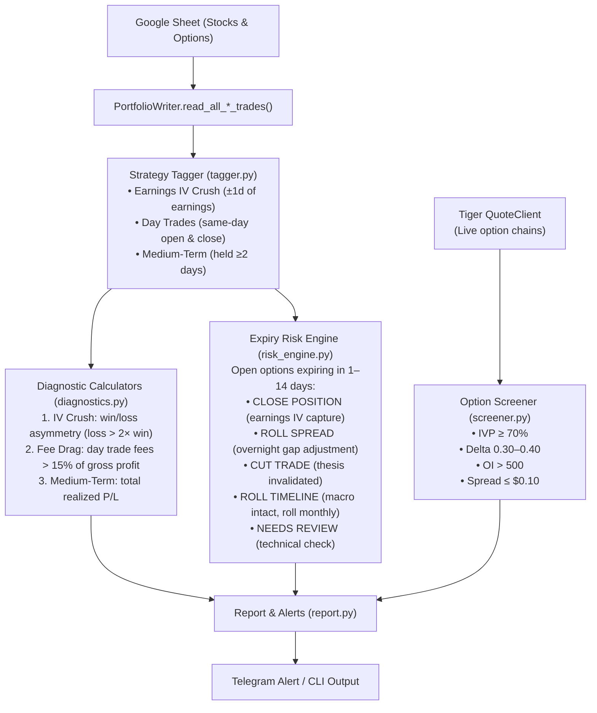
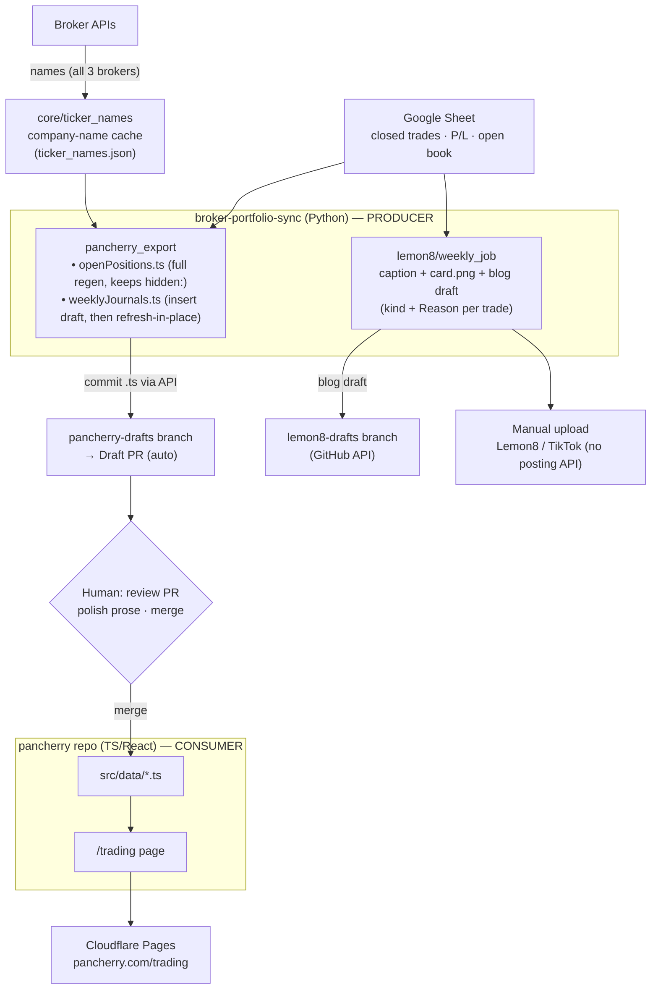
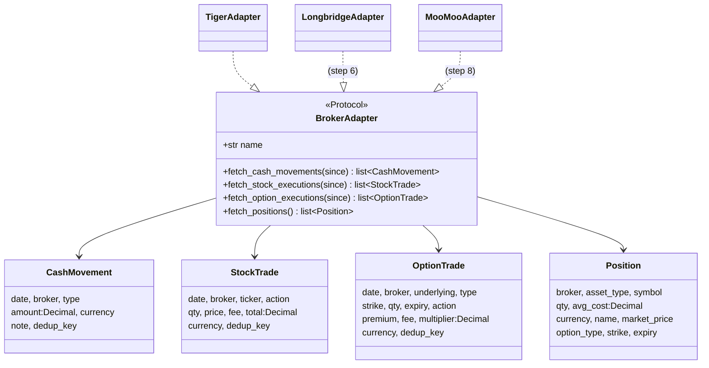
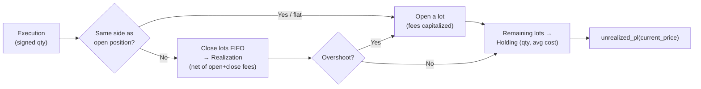

# broker-portfolio-sync

Automated consolidation of holdings and P/L across three Singapore brokerage
accounts — **Longbridge**, **Tiger Brokers**, **MooMoo** — into a single,
automation-native **Google Sheet**, updated daily and unattended. It replaces a
manual copy-paste workflow into a legacy Excel workbook.

Downstream, the same sheet feeds a **weekly content pipeline**: this repo also
generates the [pancherry](https://pancherry.com) site's trading-journal data
files and the Lemon8/TikTok post drafts (caption + transactions card + blog),
opening them as review-only Draft PRs. The sheet is the single source of truth;
the site is a pure consumer.

**Non-goals:** no trading/order placement, no investment advice, no migration of
legacy history (fresh start with cost-basis seeding). No auto-publishing — social
posts are uploaded by hand; site PRs are merged by hand.

---

## Architecture

All-API pipeline. Each broker SDK is wrapped by an adapter that emits one common
schema; everything downstream is broker-agnostic.



**Runner:** Cloud Run job triggered by Cloud Scheduler. MooMoo's OpenD gateway
runs as a sidecar (Cloud Run multi-container). Bootstrap alternative: GitHub
Actions cron for the Longbridge + Tiger legs (no gateway needed). Locally on
Windows, the daily and weekly jobs run via Task Scheduler (`scripts/*.ps1`).

**Secrets:** Google Secret Manager (or GitHub secrets). Never in code, repo, or
the sheet.

---

## Data flow per run



**Correctness guarantees:**
- **Idempotency (§6)** — every row has a stable `_dedup_key`; the writer upserts,
  so re-running any day yields the same sheet state.
- **Reproducibility (§7)** — daily FX rates are cached by `(date, pair)`, so a
  historical row always converts identically.
- **Fail loud (§9)** — on error/empty/schema drift the run stops and alerts; a
  silent half-write is worse than no write.
- **Decimal money** — `Decimal` for all money/qty, explicit currency per row.

---

## Scheduled jobs

One daily writer keeps the sheet current; everything else is a **read-only**
weekly job downstream of it. Each has its own entrypoint and PowerShell task
(`scripts/register_*_task.ps1` to install; `scripts/*.ps1` to run).

| Cadence | Job | Entrypoint | Reads / Writes |
|---------|-----|-----------|----------------|
| Daily 06:00 | Portfolio sync + Market Analytics | `python run.py --analytics` | fetch brokers → **writes** sheet + strategy tags, daily movers, earnings alerts & short option picks → Telegram |
| Weekly (Sun) | Expiry watch | `python -m alerting.expiry` | reads Options → Telegram: contracts expiring ≤ 7 days |
| Weekly (Sun) | Realized-P/L digest | `python -m alerting.weekly_pl_alert` | reads closed trades → Telegram: week's realized P/L by broker |
| Weekly (Sun) | Lemon8 journal | `python -m lemon8.weekly_job` | reads closed trades → caption + card + blog draft, commits blog draft |
| Weekly (Sun) | pancherry export | `python -m core.ticker_names` then `python -m pancherry_export --pr` | refreshes ticker names, regenerates `.ts`, opens/updates a Draft PR |
| On-demand | Standalone Market Analytics | `python -m analytics.report --notify` | runs strategy tagging, diagnostics, movers, earnings & option screener |
| Intraday | Long-option take-profit | `python -m alerting.take_profit` | reads **live** broker positions → Telegram: long options at/above +50% unrealized (`--dry-run` prints instead) |
| Intraday | Earnings IV Exit | `python -m alerting.earnings_iv_exit` | reads **live** broker positions → Telegram: alerts to close short premium options day before earnings |
| Daily 16:30 | IV Logger | `python -m analytics.iv_logger` | fetches options chain → **writes** `iv_history.json` |
| On-demand | Earnings Planner | `python -m analytics.earnings_planner` | reads `iv_history.json` → **writes** Earnings Plan sheet tab |
| On-demand | Position sizing (2% rule) | `python -m analytics.position_sizing --equity 25000 --entry 180 --stop 174` | prints shares/contracts sized to a fixed % of equity (options: `--max-loss-per-contract`) |

All weekly jobs are **fail-soft and read-only against the sheet** — a broker or
GitHub being down degrades that leg without touching the sync or the others.

---

## Analytics & Diagnostic Module (`analytics/`)

A diagnostic and risk management layer that processes the Google Sheet data maintained by the sync.



### How to Check & Run Analysis

You can run the analytics anytime in your terminal:

```bash
# 1. Run analysis and print report to terminal (read-only against your sheet)
./.venv/Scripts/python.exe -m analytics.report

# 2. Run analysis and send Telegram alert
./.venv/Scripts/python.exe -m analytics.report --notify

# 3. Run full sync and immediately output analytics
./.venv/Scripts/python.exe run.py --analytics
```

---

## Repository layout

```
broker-portfolio-sync/
├─ adapters/              # broker adapters + common schema
│  ├─ base.py             # ✅ Protocol + dataclasses (the contract)
│  ├─ tiger.py            # ✅ Tiger (tigeropen)
│  ├─ longbridge.py       # ✅ Longbridge (longport)
│  └─ moomoo.py           # ✅ MooMoo (futu-api, via OpenD)
├─ core/                  # pure pipeline logic
│  ├─ fifo_pl.py          # ✅ FIFO realized/unrealized P/L + option expiry
│  ├─ fx.py               # ✅ trade-date vs current, cached (Frankfurter)
│  ├─ reconcile.py        # ✅ seeding + post-write qty check
│  └─ ticker_names.py     # ✅ broker → {ticker: company name} cache (blog)
├─ analytics/             # ✅ Portfolio analytics & option screener
│  ├─ tagger.py           #    Strategy tagging (IV Crush, Day Trade, Medium-Term)
│  ├─ earnings.py         #    Earnings date lookup (yfinance API + JSON cache)
│  ├─ earnings_dates.json #    Local cache of quarterly earnings dates
│  ├─ diagnostics.py      #    3 diagnostic calculators (IV crush, fee drag, alpha)
│  ├─ risk_engine.py      #    1–14 DTE expiry risk engine + playbook signals
│  ├─ screener.py         #    Live option screener via Tiger QuoteClient
│  └─ report.py           #    Analytics orchestrator & Telegram report formatter
├─ sheets/writer.py       # ✅ service-account auth, idempotent upsert, Tag & Reason
├─ alerting/              # ✅ Telegram (stdlib urllib, best-effort)
│  ├─ notify.py           #    core send
│  ├─ expiry.py           # ✅ weekly expiry watch (≤ 7 days)
│  └─ weekly_pl_alert.py  # ✅ weekly realized-P/L digest
├─ lemon8/                # ✅ weekly journal (read-only): reader, journal,
│                         #    card (SVG→PNG), blog commit, weekly_job
├─ pancherry_export/      # ✅ .ts generation (exporter) + auto Draft PR (publish)
├─ skills/                # ✅ lemon8-journal-writer skill
├─ scripts/               # ✅ Windows Task Scheduler entrypoints (daily + weekly)
├─ config/settings.py     # secrets from env / Secret Manager
├─ run.py                 # ✅ entrypoint: fetch→[seed]→FIFO→FX→write→reconcile→log→alert
├─ Dockerfile             # ✅ job container (+ .dockerignore)
├─ DEPLOY.md              # ✅ GitHub Actions cron / Cloud Run Job + Scheduler
├─ opend/                 # ✅ MooMoo OpenD sidecar (Dockerfile, compose, entrypoint)
├─ tests/                 # ✅ test suite (260 passing tests)
└─ requirements.txt
```

Downstream of the sync, the **Sheet is the single source of truth** for two weekly
deliverables. Generation lives entirely in this repo (it needs the sheet schema,
the percentages-only privacy rule, and the service-account creds); the pancherry
site is a pure **consumer** that just renders the generated data files.



**Names are decoupled from the daily sync** — `python -m core.ticker_names`
connects to all three brokers on its own (Tiger/Longbridge direct, MooMoo via
OpenD), fail-soft per broker, and caches `ticker → company name` for the open
-positions grid. The weekly export runs it first, then regenerates the `.ts`.

**Weekly ritual:** run `python -m pancherry_export --pr` → review the Draft PR
(edit prose if the highlights/narrative drifted — the run flags it) → merge.

- **Stat tiles refresh, prose doesn't.** A re-run updates only the numeric
  fields (`trades`/`wins`/`losses`/`winRatePct`/dates) on an existing week's
  entry — your narrative and curated highlights survive. Numbers hard-coded into
  prose sentences are **not** rewritten, so keep prose qualitative.
- **Drift warning.** If more trades close after the draft, the re-run reports the
  new count and whether the auto-picked highlight set changed, so you know to
  revise the story before merging.
- **Nothing goes live unattended** — drafts land on a `*-drafts` branch, never the
  branch Cloudflare Pages builds; publishing is the merge you control.

**Every trade carries its *which* and *why*:**
- **Which / kind** — each trade shows its type, derived from data already synced:
  the option **Strategy** (e.g. `Short Put`, `Cash Secured Put`), or a stock's
  **Buy/Sell**. It appears in the caption top-movers `(kind)`, a blog
  `Strategy / Action` column, and a `STRATEGY` column on the transactions card.
- **Why / thesis** — a manual **`Reason`** column on the Stocks/Options tabs. You
  type the trade thesis by hand in the sheet; it flows into the blog's `Why`
  column and a short note on the caption's top movers. The sheet is the input —
  the daily sync writes `Reason` blank and **preserves whatever you typed** (it
  never clobbers a hand-entered reason), so it's safe to fill in over time. The
  blog's weekly `Rationale & lessons` narrative section stays for the bigger story.

---

## The common schema (adapter ↔ pipeline contract)

Every adapter implements one protocol and returns four normalized dataclasses.
Nothing downstream knows which broker a row came from except via the `Broker`
field.



### FIFO P/L engine (built)

Signed FIFO handles both long stock trading and the user's short-premium option
strategies (sell-to-open, buy-to-close). Realized P/L is **native currency, net
of fees**; FX conversion happens afterwards (step 4).



- `compute_stock_pl(trades)` / `compute_option_pl(trades)` → `FifoResult`
  (`realizations`, `holdings`, `realized_by_key`, `total_realized`).
- `Opening Balance` seed rows (§5) become the initial lot; their qty is **signed**
  (positive long, negative short).

---

## Target workbook (§4)

Machine-owned tabs — written by the pipeline, never hand-edited:

| Tab | Purpose |
|-----|---------|
| **Transactions** | External cash flow only (Deposit/Withdrawal), per broker, native + SGD |
| **Stocks** | One row per buy/sell execution + computed holdings summary (qty, avg cost, market value, unrealized P/L) |
| **Options** | One row per option execution + summary (mirrors the user's existing options tracking) |
| **Dashboard** | Per-broker rollup: deposits, net capital in, account value, fees, unrealized P/L, ROI, plus **rolling realized P/L** for This Week / This Month / This Year — per currency and SGD |
| **Run Log** | One row per run: status, rows added/updated, FX rates used, reconciliation result, warnings/errors |

A hidden `_dedup_key` column on each data tab drives idempotent upserts. The
Stocks/Options tabs also carry one **hand-editable** column, `Reason` — a
free-text trade thesis you fill in, kept as the trailing column so the sync
preserves it on every run (see the content pipeline above).

---

## Repository layout

```
broker-portfolio-sync/
├─ adapters/              # broker adapters + common schema
│  ├─ base.py             # ✅ Protocol + dataclasses (the contract)
│  ├─ tiger.py            # ✅ Tiger (tigeropen)
│  ├─ longbridge.py       # ✅ Longbridge (longport)
│  └─ moomoo.py           # ✅ MooMoo (futu-api, via OpenD)
├─ core/                  # pure pipeline logic
│  ├─ fifo_pl.py          # ✅ FIFO realized/unrealized P/L + option expiry
│  ├─ fx.py               # ✅ trade-date vs current, cached (Frankfurter)
│  ├─ reconcile.py        # ✅ seeding + post-write qty check
│  └─ ticker_names.py     # ✅ broker → {ticker: company name} cache (blog)
├─ sheets/writer.py       # ✅ service-account auth, idempotent upsert, Reason-preserve
├─ alerting/              # ✅ Telegram (stdlib urllib, best-effort)
│  ├─ notify.py           #    core send
│  ├─ expiry.py           # ✅ weekly expiry watch (≤ 7 days)
│  └─ weekly_pl_alert.py  # ✅ weekly realized-P/L digest
├─ lemon8/                # ✅ weekly journal (read-only): reader, journal,
│                         #    card (SVG→PNG), blog commit, weekly_job
├─ pancherry_export/      # ✅ .ts generation (exporter) + auto Draft PR (publish)
├─ skills/                # ✅ lemon8-journal-writer skill
├─ scripts/               # ✅ Windows Task Scheduler entrypoints (daily + weekly)
├─ config/settings.py     # secrets from env / Secret Manager
├─ run.py                 # ✅ entrypoint: fetch→[seed]→FIFO→FX→write→reconcile→log→alert
├─ Dockerfile             # ✅ job container (+ .dockerignore)
├─ DEPLOY.md              # ✅ GitHub Actions cron / Cloud Run Job + Scheduler
├─ opend/                 # ✅ MooMoo OpenD sidecar (Dockerfile, compose, entrypoint)
├─ tests/                 # ✅ FIFO, schema, adapters, run, lemon8, export (232)
└─ requirements.txt
```

---

## Getting started

### Prerequisites
- Python 3.11, a virtualenv (`.venv/` is used here).
- Broker credentials + a Google Cloud service account — **user-provided** (§13),
  never committed. See the checklist below.

### Install & test
```bash
python -m venv .venv
./.venv/Scripts/python.exe -m pip install -r requirements.txt
./.venv/Scripts/python.exe -m pytest -q
```
> **Windows note:** set `PYTHONUTF8=1` before scripts that print SDK objects, or
> cp1252 will crash on non-ASCII output.

### User setup checklist (cannot be done by the pipeline — §13)
- [ ] **Longbridge**: developer verification → token (open.longbridge.com)
- [ ] **Tiger**: RSA keypair + `tiger_id` + account, `license='TBSG'` (developer.itigerup.com)
- [ ] **MooMoo**: Futu/moomoo ID for OpenD login; decide OpenD host (sidecar)
- [ ] **Google Cloud**: service account + JSON key
- [ ] Share the new Sheet with the service-account email (**Editor**)
- [ ] Put all secrets in Secret Manager (or GitHub secrets)
- [ ] Confirm each account's traded currencies (for FX pairs)
- [ ] Choose alert channel (Telegram/email) + provide its credential

---

## Design principles

1. **Decimal money, never float** — coerce via `adapters.base.dec()`.
2. **Explicit, upper-cased currency** on every money row.
3. **Stable `_dedup_key`** (`Broker:fill_id` or hash; `Broker:opening:ticker` for seeds) → idempotent upserts.
4. **Sign convention:** acquisitions negative, sells positive.
5. **Realized P/L is net of fees** (buy fees capitalized, sell fees deducted).
6. **Opening Balance qty is signed** so shorts can be seeded.
7. **Adapters don't compute P/L** — FIFO does; FX converts.
8. **Fail loud** on schema drift / errors — never half-write.

---

## License / privacy

Personal project. Real-name public content (blog/social) defaults to **percentages
and reasoning only** — absolute $ amounts are opt-in per post (§11b). Keep all
credentials and the service-account JSON out of the repo (`.gitignore` enforces this).
```
