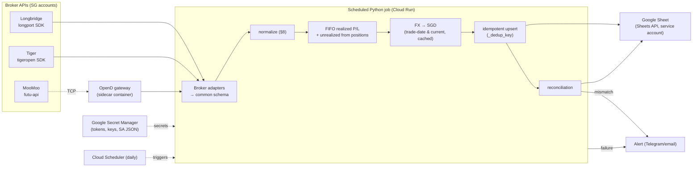
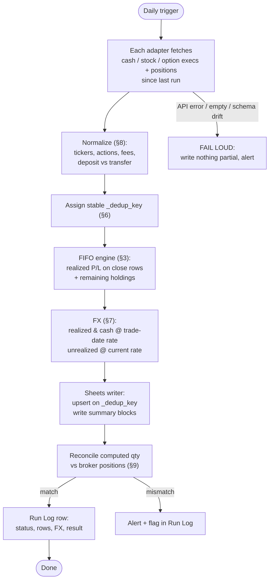
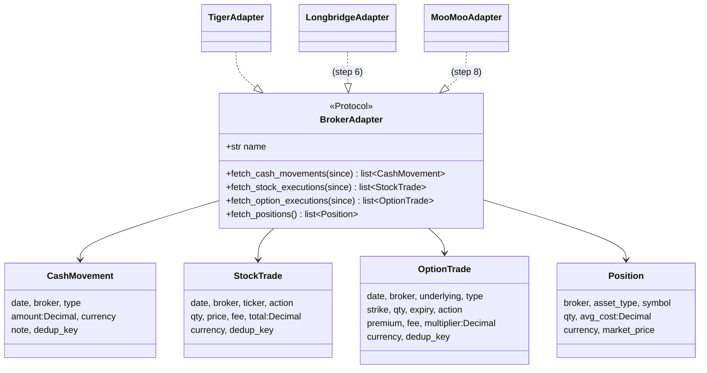
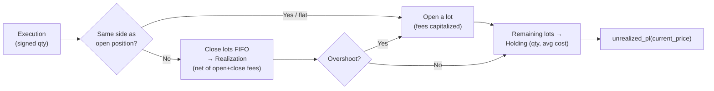

# broker-portfolio-sync

Automated consolidation of holdings and P/L across three Singapore brokerage
accounts — **Longbridge**, **Tiger Brokers**, **MooMoo** — into a single,
automation-native **Google Sheet**, updated daily and unattended. It replaces a
manual copy-paste workflow into a legacy Excel workbook.

> **Design source of truth:** [`BUILD_SPEC.md`](https://claude.ai/public/artifacts/b935403a-b127-4964-ade7-545da2383c71) (external artifact).
> **Continuing the build?** Start with [`HANDOFF.md`](HANDOFF.md) — it records
> what's built, the decisions new code must respect, and step-by-step next actions.

**Non-goals:** no trading/order placement, no investment advice, no migration of
legacy history (fresh start with cost-basis seeding).

---

## Build status

| # | Step | Module | Status |
|---|------|--------|--------|
| 1 | Common schema + dataclasses | `adapters/base.py` | ✅ done |
| 2 | Tiger adapter | `adapters/tiger.py` | ✅ done |
| 3 | FIFO P/L engine | `core/fifo_pl.py` | ✅ done |
| 4 | FX module (trade-date vs current, cached) | `core/fx.py` | ✅ done |
| 5 | Sheets writer (idempotent upsert) | `sheets/writer.py` | ✅ done |
| 6 | Longbridge adapter | `adapters/longbridge.py` | ✅ done |
| 7 | Seeding + reconciliation | `core/reconcile.py` | ✅ done |
| 8 | MooMoo adapter + OpenD sidecar | `adapters/moomoo.py`, `opend/` | ✅ done |
| 9 | Alerting + Run Log + Cloud Run/Scheduler | `alerting/`, `run.py` | ⬜ next |
| 10 | Lemon8 journal module | `lemon8/`, `skills/` | ⬜ |

**99 tests passing.**

---

## Architecture

All-API pipeline. Each broker SDK is wrapped by an adapter that emits one common
schema; everything downstream is broker-agnostic.



**Runner:** Cloud Run job triggered by Cloud Scheduler. MooMoo's OpenD gateway
runs as a sidecar (Cloud Run multi-container). Bootstrap alternative: GitHub
Actions cron for the Longbridge + Tiger legs (no gateway needed).

**Secrets:** Google Secret Manager (or GitHub secrets). Never in code, repo, or
the sheet.

---

## Data flow per run



**Correctness guarantees:**
- **Idempotency (§6)** — every row has a stable `_dedup_key`; the writer upserts,
  so re-running any day yields the same sheet state.
- **Reproducibility (§7)** — daily FX rates are cached by `(date, pair)`, so a
  historical row always converts identically.
- **Fail loud (§9)** — on error/empty/schema drift the run stops and alerts; a
  silent half-write is worse than no write.
- **Decimal money** — `Decimal` for all money/qty, explicit currency per row.

---

## The common schema (adapter ↔ pipeline contract)

Every adapter implements one protocol and returns four normalized dataclasses.
Nothing downstream knows which broker a row came from except via the `Broker`
field.



### FIFO P/L engine (built)

Signed FIFO handles both long stock trading and the user's short-premium option
strategies (sell-to-open, buy-to-close). Realized P/L is **native currency, net
of fees**; FX conversion happens afterwards (step 4).



- `compute_stock_pl(trades)` / `compute_option_pl(trades)` → `FifoResult`
  (`realizations`, `holdings`, `realized_by_key`, `total_realized`).
- `Opening Balance` seed rows (§5) become the initial lot; their qty is **signed**
  (positive long, negative short).

---

## Target workbook (§4)

Machine-owned tabs — written by the pipeline, never hand-edited:

| Tab | Purpose |
|-----|---------|
| **Transactions** | External cash flow only (Deposit/Withdrawal), per broker, native + SGD |
| **Stocks** | One row per buy/sell execution + computed holdings summary (qty, avg cost, market value, unrealized P/L) |
| **Options** | One row per option execution + summary (mirrors the user's existing options tracking) |
| **Dashboard** | Per-broker rollup: deposits, net capital in, account value, fees, realized/unrealized P/L, ROI — per currency and SGD |
| **Run Log** | One row per run: status, rows added/updated, FX rates used, reconciliation result, warnings/errors |

A hidden `_dedup_key` column on each data tab drives idempotent upserts.

---

## Repository layout

```
broker-portfolio-sync/
├─ adapters/          # broker adapters + common schema
│  ├─ base.py         # ✅ Protocol + dataclasses (the contract)
│  ├─ tiger.py        # ✅ Tiger (tigeropen)
│  ├─ longbridge.py   # ✅ Longbridge (longport)
│  └─ moomoo.py       # ✅ MooMoo (moomoo-api, via OpenD)
├─ core/              # pure pipeline logic
│  ├─ fifo_pl.py      # ✅ FIFO realized/unrealized P/L
│  ├─ fx.py           # ✅ trade-date vs current, cached (Frankfurter)
│  ├─ normalize.py    # ⬜ centralize §8 rules
│  ├─ dedup.py        # (dedup helpers currently in base.py)
│  └─ reconcile.py    # ✅ seeding + post-write qty check
├─ sheets/writer.py   # ✅ service-account auth, idempotent upsert
├─ alerting/notify.py # ⬜ step 9 — Telegram / email
├─ lemon8/            # ⬜ step 10 — weekly journal module (read-only)
├─ skills/            # ⬜ step 10 — lemon8-journal-writer skill
├─ config/settings.py # secrets from env / Secret Manager
├─ run.py             # ⬜ entrypoint: fetch→normalize→compute→write→reconcile→log
├─ Dockerfile         # ⬜ job container
├─ opend/             # ✅ MooMoo OpenD sidecar (Dockerfile, compose, entrypoint)
├─ tests/             # ✅ FIFO, schema, adapter, dedup idempotency
├─ requirements.txt
├─ BUILD_SPEC.md      # (external link — source of truth)
└─ HANDOFF.md         # continuation spec for the next builder
```

---

## Getting started

### Prerequisites
- Python 3.11, a virtualenv (`.venv/` is used here).
- Broker credentials + a Google Cloud service account — **user-provided** (§13),
  never committed. See the checklist below.

### Install & test
```bash
python -m venv .venv
./.venv/Scripts/python.exe -m pip install -r requirements.txt
./.venv/Scripts/python.exe -m pytest -q
```
> **Windows note:** set `PYTHONUTF8=1` before scripts that print SDK objects, or
> cp1252 will crash on non-ASCII output.

### User setup checklist (cannot be done by the pipeline — §13)
- [ ] **Longbridge**: developer verification → token (open.longbridge.com)
- [ ] **Tiger**: RSA keypair + `tiger_id` + account, `license='TBSG'` (developer.itigerup.com)
- [ ] **MooMoo**: Futu/moomoo ID for OpenD login; decide OpenD host (sidecar)
- [ ] **Google Cloud**: service account + JSON key
- [ ] Share the new Sheet with the service-account email (**Editor**)
- [ ] Put all secrets in Secret Manager (or GitHub secrets)
- [ ] Confirm each account's traded currencies (for FX pairs)
- [ ] Choose alert channel (Telegram/email) + provide its credential

---

## Design principles (see [`HANDOFF.md`](HANDOFF.md) §3 for the binding list)

1. **Decimal money, never float** — coerce via `adapters.base.dec()`.
2. **Explicit, upper-cased currency** on every money row.
3. **Stable `_dedup_key`** (`Broker:fill_id` or hash; `Broker:opening:ticker` for seeds) → idempotent upserts.
4. **Sign convention:** acquisitions negative, sells positive.
5. **Realized P/L is net of fees** (buy fees capitalized, sell fees deducted).
6. **Opening Balance qty is signed** so shorts can be seeded.
7. **Adapters don't compute P/L** — FIFO does; FX converts.
8. **Fail loud** on schema drift / errors — never half-write.

---

## License / privacy

Personal project. Real-name public content (blog/social) defaults to **percentages
and reasoning only** — absolute $ amounts are opt-in per post (§11b). Keep all
credentials and the service-account JSON out of the repo (`.gitignore` enforces this).
```
