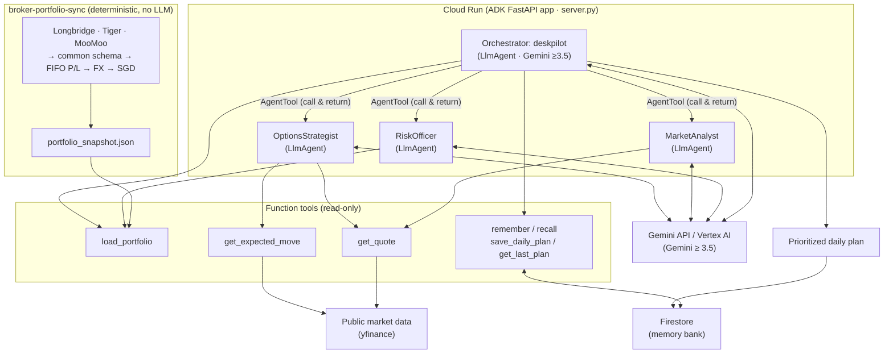
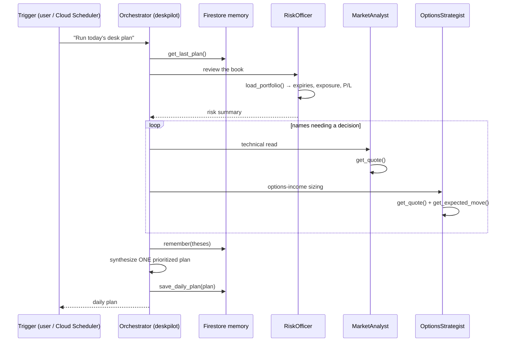

# Architecture

Deskpilot is an ADK multi-agent system on Gemini, served on Cloud Run, with a
Firestore memory bank. It reasons over a portfolio snapshot produced by the
deterministic `broker-portfolio-sync` pipeline.

## Agent graph + infrastructure



## Daily run sequence



## Design choices

- **Orchestrator–specialist over one mega-prompt.** Each specialist has a narrow
  instruction and only the tools it needs, which keeps tool-selection accurate
  and the reasoning auditable (ADK streams every tool call).
- **AgentTool, not sub-agent transfer.** The Orchestrator calls each specialist
  *as a tool* (ADK `AgentTool`) and keeps control for the whole run, so it can
  gather every specialist's output and finish by persisting one plan. A plain
  `sub_agents` transfer hands control away and never returns — which cannot
  complete a prescribed multi-step routine.
- **Deterministic data, agentic judgment.** Numbers (P/L, FIFO, FX, technicals)
  come from deterministic code; Gemini does prioritization and synthesis, not
  arithmetic. This is the split that makes the output trustworthy.
- **Read-only by construction.** No tool can place or modify an order; the
  guardrail is enforced by the tool surface, not just the prompt.
- **Memory as a first-class tool.** `save_daily_plan` / `get_last_plan` let the
  agent compare intent across days — the core of the "operator" framing.
- **Graceful degradation.** Firestore → local JSON fallback; every market tool
  returns an error dict instead of raising, so a flaky data feed never crashes a
  run.
```
