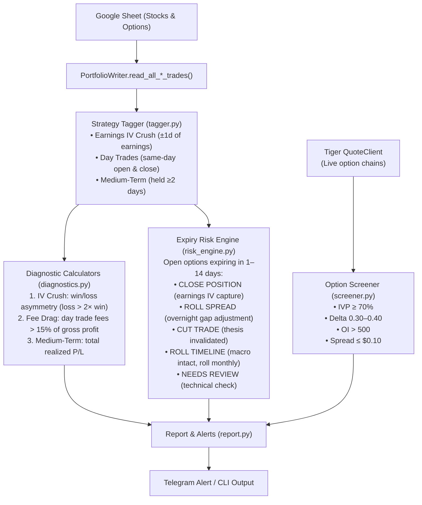

# Analytics & diagnostic module (`analytics/`)

A diagnostic and risk-management layer that processes the Google Sheet data
maintained by the sync. It is read-only against the sheet and never places
orders. For the options decision-support layer (payoff, trade plans, spread
builder) see [options-playbook.md](options-playbook.md).



## Package layout

```
analytics/
├─ reporting/          # Report orchestration
│  └─ report.py          # Analytics orchestrator & Telegram report formatter
├─ data/               # Local JSON caches (earnings dates, IV history)
├─ earnings/           # Earnings & IV-crush domain
│  ├─ earnings.py         # Earnings date lookup (yfinance API + JSON cache)
│  ├─ earnings_move.py    # Historical earnings-move study (Step-4 edge)
│  ├─ earnings_planner.py # Writes the "Earnings Plan" sheet tab
│  ├─ iv_logger.py        # Daily ATM-IV snapshot → data/iv_history.json
│  ├─ iv_crush.py         # IV-crush screener (4-step playbook grade)
│  └─ iv_crush_history.py # Crush consistency + magnitude (Steps 2 & 3)
├─ screening/          # Signal scanners
│  ├─ screener.py         # Live option screener via Tiger QuoteClient
│  ├─ market_scan.py      # Daily movers, earnings calendar, short-option picks
│  ├─ swing.py            # Swing-setup scanner (Breakout / Pullback-buy / etc.)
│  └─ tagger.py           # Strategy tagging (IV Crush, Day Trade, Medium-Term)
├─ risk/               # Risk & sizing
│  ├─ risk_engine.py      # 1–14 DTE expiry risk engine + playbook signals
│  ├─ position_sizing.py  # Fixed-fractional 2% position sizing
│  └─ diagnostics.py      # 3 diagnostic calculators (IV crush, fee drag, alpha)
└─ options/            # Options-playbook domain (see options-playbook.md)
```

## How to check & run analysis

You can run the analytics anytime in your terminal:

```bash
# 1. Run analysis and print report to terminal (read-only against your sheet)
./.venv/Scripts/python.exe -m analytics.reporting.report

# 2. Run analysis and send Telegram alert
./.venv/Scripts/python.exe -m analytics.reporting.report --notify

# 3. Run full sync and immediately output analytics
./.venv/Scripts/python.exe run.py --analytics
```

