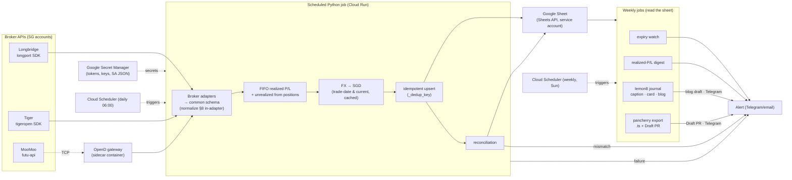
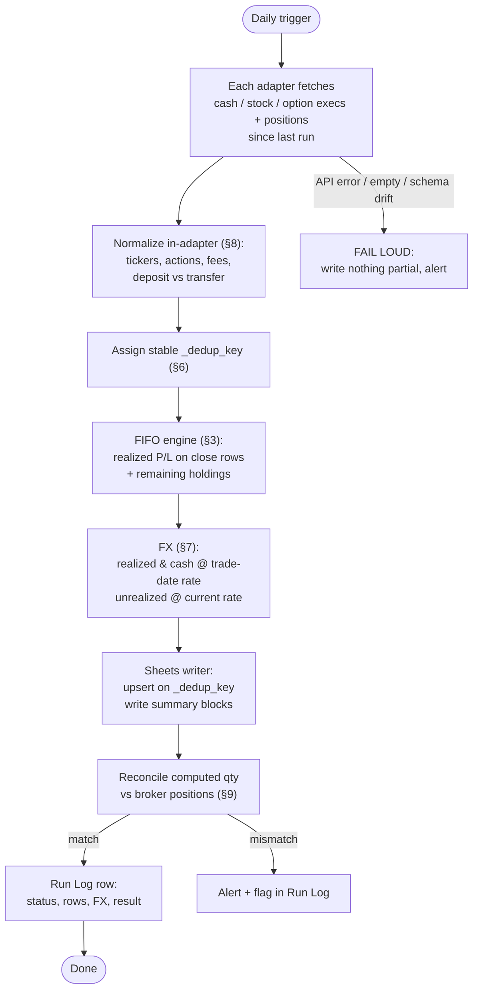
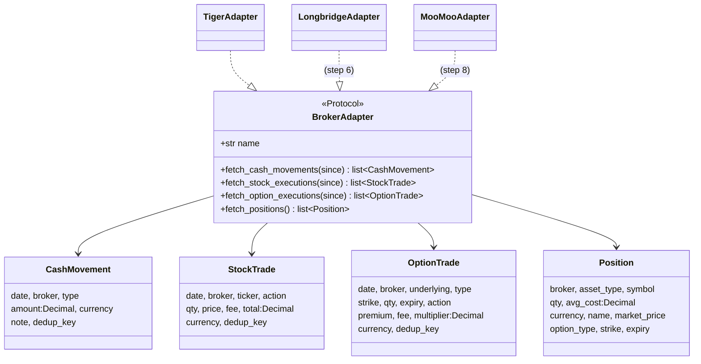
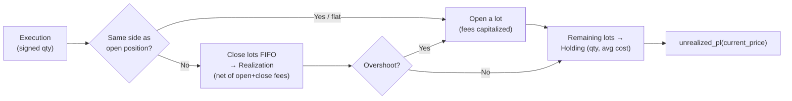

# Architecture & core pipeline

How the daily sync turns three brokers into one Google Sheet, and the guarantees
that make a re-run safe. For the job schedule see
[scheduled-jobs.md](scheduled-jobs.md); for setup see
[getting-started.md](getting-started.md).

## Architecture

All-API pipeline. Each broker SDK is wrapped by an adapter that emits one common
schema; everything downstream is broker-agnostic.

**Runner:** Cloud Run job triggered by Cloud Scheduler. MooMoo's OpenD gateway
runs as a sidecar (Cloud Run multi-container). Bootstrap alternative: GitHub
Actions cron for the Longbridge + Tiger legs (no gateway needed). Locally on
Windows, the daily and weekly jobs run via Task Scheduler (`scripts/*.ps1`).

**Secrets:** Google Secret Manager (or GitHub secrets). Never in code, repo, or
the sheet.

## Data flow per run

**Correctness guarantees:**
- **Idempotency (§6)** — every row has a stable `_dedup_key`; the writer upserts,
  so re-running any day yields the same sheet state.
- **Reproducibility (§7)** — daily FX rates are cached by `(date, pair)`, so a
  historical row always converts identically.
- **Fail loud (§9)** — on error/empty/schema drift the run stops and alerts; a
  silent half-write is worse than no write.
- **Decimal money** — `Decimal` for all money/qty, explicit currency per row.

## The common schema (adapter ↔ pipeline contract)

Every adapter implements one protocol and returns four normalized dataclasses.
Nothing downstream knows which broker a row came from except via the `Broker`
field.

### FIFO P/L engine

Signed FIFO handles both long stock trading and the user's short-premium option
strategies (sell-to-open, buy-to-close). Realized P/L is **native currency, net
of fees**; FX conversion happens afterwards (step 4).

- `compute_stock_pl(trades)` / `compute_option_pl(trades)` → `FifoResult`
  (`realizations`, `holdings`, `realized_by_key`, `total_realized`).
- `Opening Balance` seed rows (§5) become the initial lot; their qty is **signed**
  (positive long, negative short).

## Target workbook (§4)

Machine-owned tabs — written by the pipeline, never hand-edited:

| Tab | Purpose |
|-----|---------|
| **Transactions** | External cash flow only (Deposit/Withdrawal), per broker, native + SGD |
| **Stocks** | One row per buy/sell execution + computed holdings summary (qty, avg cost, market value, unrealized P/L) |
| **Options** | One row per option execution + summary (mirrors the user's existing options tracking) |
| **Dashboard** | Per-broker rollup: deposits, net capital in, account value, fees, unrealized P/L, ROI, plus **rolling realized P/L** for This Week / This Month / This Year — per currency and SGD |
| **Run Log** | One row per run: status, rows added/updated, FX rates used, reconciliation result, warnings/errors |

A hidden `_dedup_key` column on each data tab drives idempotent upserts. The
Stocks/Options tabs also carry one **hand-editable** column, `Reason` — a
free-text trade thesis you fill in, kept as the trailing column so the sync
preserves it on every run (see [content-pipeline.md](content-pipeline.md)).

## Design principles

1. **Decimal money, never float** — coerce via `adapters.base.dec()`.
2. **Explicit, upper-cased currency** on every money row.
3. **Stable `_dedup_key`** (`Broker:fill_id` or hash; `Broker:opening:ticker` for seeds) → idempotent upserts.
4. **Sign convention:** acquisitions negative, sells positive.
5. **Realized P/L is net of fees** (buy fees capitalized, sell fees deducted).
6. **Opening Balance qty is signed** so shorts can be seeded.
7. **Adapters don't compute P/L** — FIFO does; FX converts.
8. **Fail loud** on schema drift / errors — never half-write.
