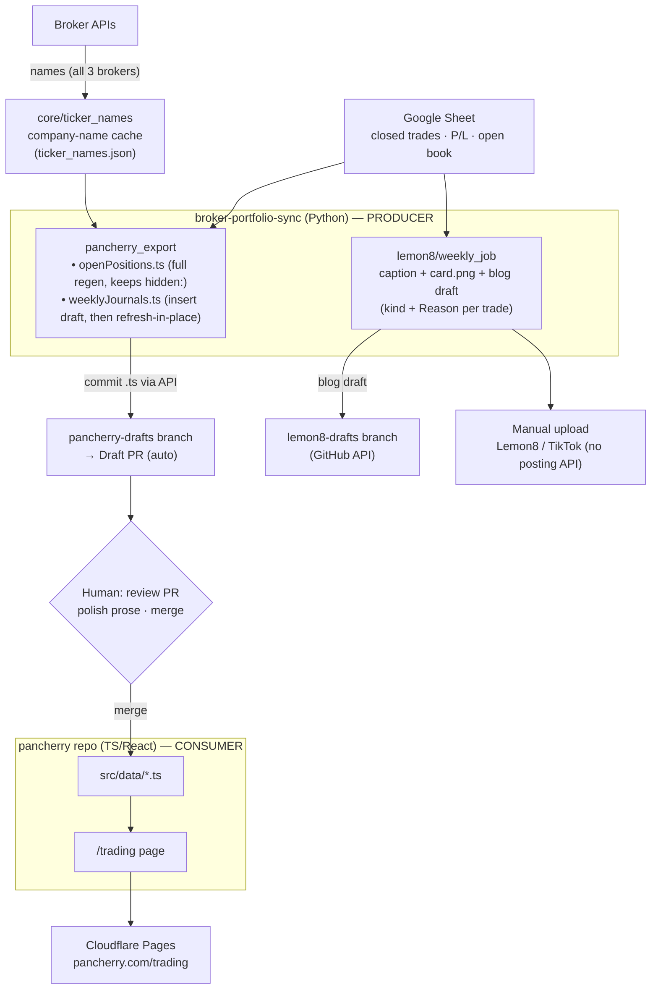

# Weekly content pipeline (pancherry + Lemon8)

Downstream of the sync, the **Sheet is the single source of truth** for two
weekly deliverables. Generation lives entirely in this repo (it needs the sheet
schema, the percentages-only privacy rule, and the service-account creds); the
[pancherry](https://pancherry.com) site is a pure **consumer** that just renders
the generated data files.



**Names are decoupled from the daily sync** — `python -m core.ticker_names`
connects to all three brokers on its own (Tiger/Longbridge direct, MooMoo via
OpenD), fail-soft per broker, and caches `ticker → company name` for the open
-positions grid. The weekly export runs it first, then regenerates the `.ts`.

**Weekly ritual:** run `python -m pancherry_export --pr` → review the Draft PR
(edit prose if the highlights/narrative drifted — the run flags it) → merge.

- **Stat tiles refresh, prose doesn't.** A re-run updates only the numeric
  fields (`trades`/`wins`/`losses`/`winRatePct`/dates) on an existing week's
  entry — your narrative and curated highlights survive. Numbers hard-coded into
  prose sentences are **not** rewritten, so keep prose qualitative.
- **Drift warning.** If more trades close after the draft, the re-run reports the
  new count and whether the auto-picked highlight set changed, so you know to
  revise the story before merging.
- **Nothing goes live unattended** — drafts land on a `*-drafts` branch, never the
  branch Cloudflare Pages builds; publishing is the merge you control.

## Weekly workflow (step by step)

```
1. Run the export       → python -m pancherry_export --pr
2. Review the Draft PR  → GitHub shows the diff for weeklyJournals.ts
3. Edit prose on the PR → pencil icon on the file, or checkout the branch locally
4. Merge when ready     → published: true entries go live on Cloudflare Pages
```

**What you can safely edit on the PR branch** (a re-run never overwrites these):

| Field | What to write | Example |
|---|---|---|
| `title` | Your editorial headline | `"Storage Cycle Runs & Disciplined Cuts"` |
| `summary` | 1–2 sentence teaser | `"A high-activity week anchored by SanDisk..."` |
| `body` | Array of paragraph strings | Your narrative — rationale, lessons, outlook |
| `highlights[].note` | Per-trade colour text | `"Breakout entry on volume confirmation"` |

**What auto-refreshes** if you re-run `--pr` mid-week (more trades closed):
`trades`, `wins`, `losses`, `winRatePct`, `weekOf`, `startDate`, `endDate`.

**If you want to edit locally instead of on GitHub:**
```bash
cd D:\Learn\Google\pancherry
git fetch origin pancherry-drafts
git checkout pancherry-drafts
# edit src/data/weeklyJournals.ts
git commit -am "polish week narrative" && git push
# then merge the PR on GitHub
```

**Every trade carries its *which* and *why*:**
- **Which / kind** — each trade shows its type, derived from data already synced:
  the option **Strategy** (e.g. `Short Put`, `Cash Secured Put`), or a stock's
  **Buy/Sell**. It appears in the caption top-movers `(kind)`, a blog
  `Strategy / Action` column, and a `STRATEGY` column on the transactions card.
- **Why / thesis** — a manual **`Reason`** column on the Stocks/Options tabs. You
  type the trade thesis by hand in the sheet; it flows into the blog's `Why`
  column and a short note on the caption's top movers. The sheet is the input —
  the daily sync writes `Reason` blank and **preserves whatever you typed** (it
  never clobbers a hand-entered reason), so it's safe to fill in over time. The
  blog's weekly `Rationale & lessons` narrative section stays for the bigger story.
