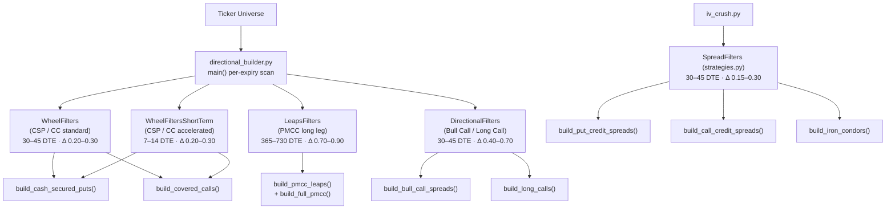

# Options playbook (read-only decision-support)

`analytics/options/` is a **read-only decision-support layer** built from the
Moomoo options-playbook material. It plans, scores and journals option
strategies; it never fetches a chain into strategy logic, submits an order, or
gives personalised advice. It is built slice-by-slice from the Moomoo
options-playbook source material (kept locally, not tracked in this repo).

```
analytics/options/
├─ option_chain.py     # Normalised quotes, quality gates + snapshot store
├─ payoff.py           # Pure Decimal expiry payoff / max-risk calculator
├─ market_context.py   # Technical, earnings and expected-move context card
├─ trade_plans.py      # Local read-only plans + lifecycle validation
├─ income_workspace.py # Wheel, CC, CSP and PMCC research workspace
├─ directional_builder.py # Directional, Wheel, LEAPS & PMCC builders + CLI
├─ mid_week_planner.py # Short-dated / weeklies expiry planner
├─ strategies.py       # Pure credit-spread / iron-condor builder + scoring
├─ portfolio_risk.py   # Portfolio-level risk limits and guardrails
└─ journal.py          # Strategy execution journal and P/L scorecard
```

## Foundations (Slices 1–2)

The payoff/chain/plan foundation is local and read-only: it never sends broker
orders. `analytics.options.payoff` provides a pure `Decimal` API for expiry
payoff/risk (unbounded results are `None`, never a made-up large number).
`analytics.options.option_chain` normalises quotes, gates them on liquidity, and
persists a snapshot so a plan can reproduce the decision that informed it.

Use the trade-plan CLI to save a plan with its evidence snapshot reference:

```bash
./.venv/Scripts/python.exe -m analytics.options.trade_plans create --ticker AAPL --strategy "Bull Call" --expiry 2026-09-18 --leg buy:call:200:5 --leg sell:call:210:2 --entry-trigger breakout --invalidation "close below 195" --exit-rule "take 50%" --risk-budget 400 --snapshot-id <snapshot-id> --approve
./.venv/Scripts/python.exe -m analytics.options.trade_plans list
```

`--approve` rejects incomplete, mixed-expiry, over-budget, or unbounded-risk
plans. The default local stores (`analytics/trade_plans.json` and
`analytics/option_snapshots.json`) are user-owned evidence, not broker data.

## Credit-spread / iron-condor builder (Slice 3)

`analytics.options.strategies` is a **pure library** — it consumes an
`OptionChainSnapshot` (from `option_chain`) and returns scored, defined-risk
candidates; it never fetches a chain, sends a notification, or places an order.

- `build_put_credit_spreads` / `build_call_credit_spreads` / `build_iron_condors`
  each return a `SpreadScan` whose `candidates` are ranked by an **explainable
  score** (return-on-risk, liquidity, expected-move buffer, event risk, optional
  IV rank) and whose `rejections` list **every discarded pair with a reason**, so
  a report can explain why nothing qualified instead of showing a blank list.
- Gating is configurable via `SpreadFilters` (documented defaults: 30–45 DTE,
  short-leg delta 0.15–0.30, ≥100 open interest, ≤15% bid-ask, expected-move
  buffer, `block_earnings`).
- RSI is surfaced only as **signal context**, never a buy/sell instruction.
- IV rank must be supplied by the caller — the builder **never fabricates** one
  from current IV.
- A live-provider → snapshot adapter is intentionally **not** wired here
  (offline-first; integrate a provider only behind the same model).

## Additional Builders (Phase 1)

The playbook contains additional dedicated strategy builders in `analytics.options`:
- **Income Workspace (`income_workspace.py`)**: Detects eligible shares and cash from your portfolio to plan Wheel, Covered Call, Cash-Secured Put, and PMCC trades. Calculates effective cost basis, yield, and assignment risks.
- **Directional Builder (`directional_builder.py`)**: Plans and scores debit spreads (bull call / bear put) and naked long options. Explicitly surfaces time-decay (theta) risk and max return capped by the spread.
- **Mid-Week Planner (`mid_week_planner.py`)**: Supports short-dated (Monday/Wednesday) setups for protective hedges or quick post-news directional trades.

## Strategy filter reference

The DTE/delta gates live in two modules: `SpreadFilters` /
`SpreadFiltersShortTerm` (credit spreads & iron condors) sit in
`analytics/options/strategies.py` and are consumed by the earnings IV-crush
path; the `DirectionalFilters` / `WheelFilters` / `LeapsFilters` family sits in
`analytics/options/directional_builder.py`, which its CLI applies per-expiry
when scanning tickers.



| Filter class | Module | Strategy | DTE range | Delta range | Notes |
|---|---|---|---|---|---|
| `SpreadFilters` | `strategies.py` | Credit spreads / IC | 30–45 | 0.15–0.30 | Standard income spreads |
| `SpreadFiltersShortTerm` | `strategies.py` | Weekly credit spreads | 7–14 | 0.15–0.30 | Short-dated income plays |
| `WheelFilters` | `directional_builder.py` | CSP / CC (standard) | 30–45 | 0.20–0.30 | Core monthly income cycle |
| `WheelFiltersShortTerm` | `directional_builder.py` | CSP / CC (accelerated) | 7–14 | 0.20–0.30 | Weekly income on high-conviction names |
| `LeapsFilters` | `directional_builder.py` | PMCC long leg | 365–730 | 0.70–0.90 | Deep ITM LEAPS as stock replacement |
| `DirectionalFilters` | `directional_builder.py` | Bull call / long call | 30–45 | 0.40–0.70 | Debit directional bets |

**Dual-DTE scanning:** The Wheel strategies (CSP/CC) are scanned at **both**
the standard (30–45) and short-term (7–14) DTE windows in a single pass, so the
builder surfaces candidates across both income cycles without allowing the
15–29 "dead zone" in between.

**PMCC cross-expiry pairing:** `build_full_pmcc()` pairs a LEAPS long call
(180–730 DTE, deep ITM) with a short call from a nearer expiry (30–45 DTE),
computing net debit and approximate max profit for the diagonal.

## Portfolio Controls & Journal (Phase 2)

- **Portfolio Risk (`portfolio_risk.py`)**: Aggregates open-option max loss, delta/theta exposure, assignment notional, and sector concentration across your linked accounts. Enforces configurable guardrails like maximum risk per trade or aggregate open risk.
- **Plan-Aware Alerts (`alerting/plan_alerts.py`)**: Replaces generic reminders with thesis-aware notifications (e.g. entry trigger hit, profit target reached, max loss invalidation) linked to the trade plans you created.
- **Strategy Journal (`journal.py`)**: The ultimate feedback loop. Links your original planned entries to the final FIFO P/L from your Google Sheet. Grades your execution discipline (e.g., stopping out correctly vs holding a loser).

## Safety boundary

- No order placement — plans, calculators and alerts stay read-only against
  brokers.
- `Decimal` for all cash/price/quantity/strike math; missing market data is never
  turned into zero; unbounded risk is represented explicitly.
- Broker fills and positions remain the accounting source of truth; a trade plan
  is a separate, user-authored intent record that may be linked to fills later.

