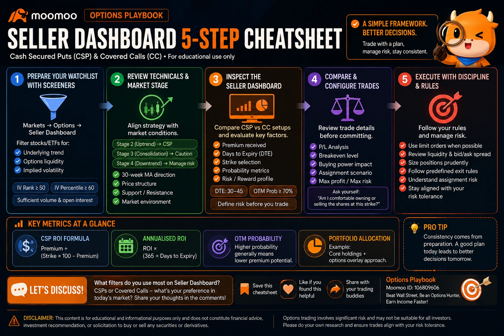
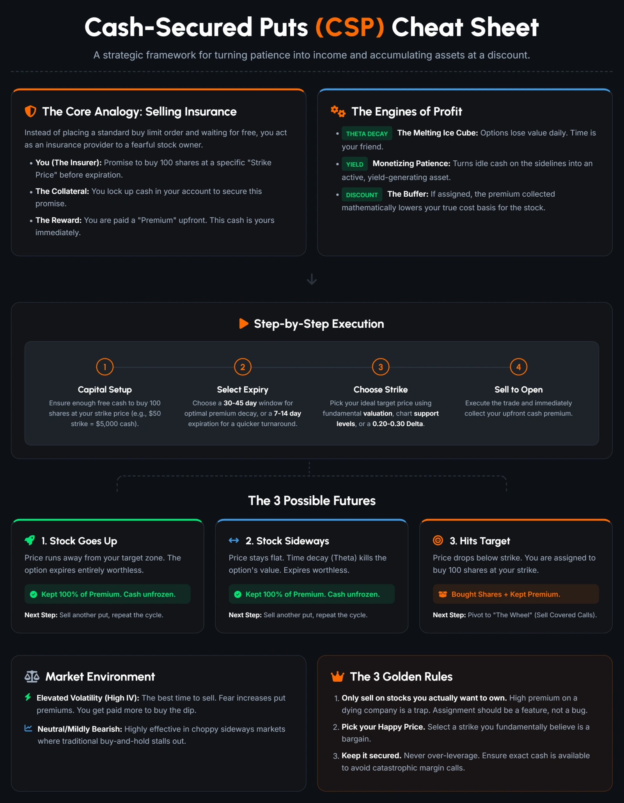
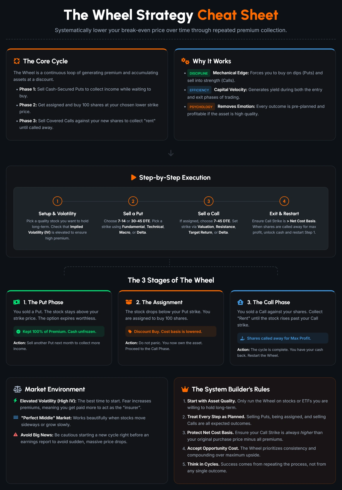
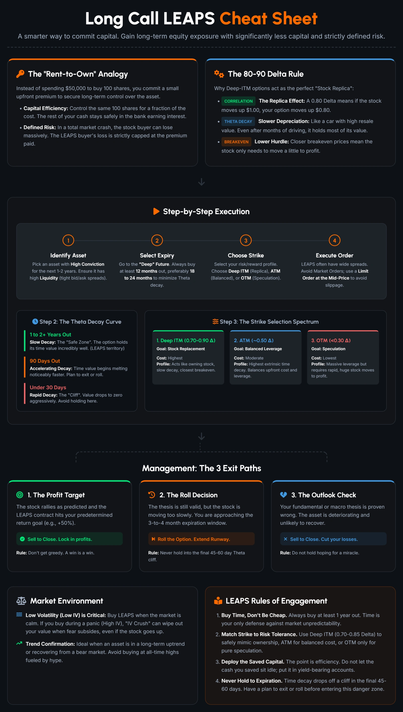
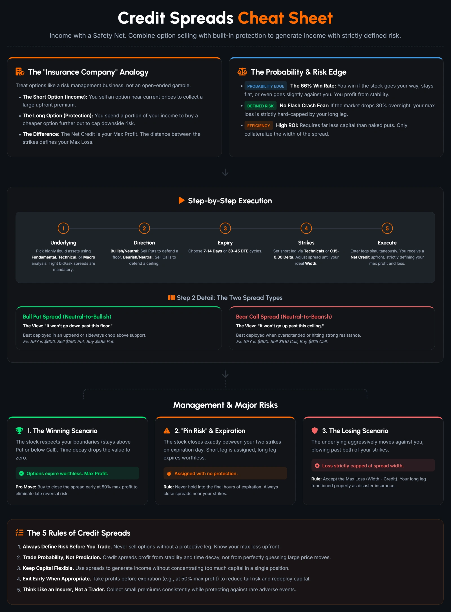
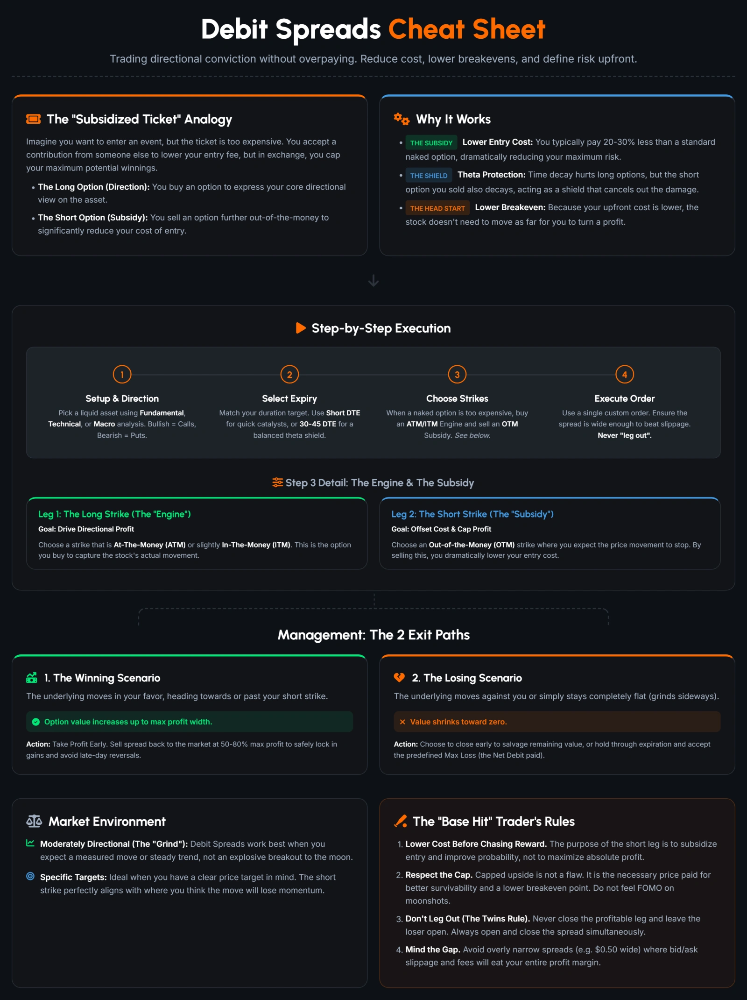
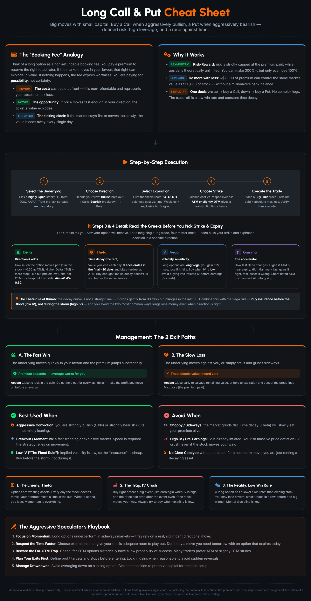
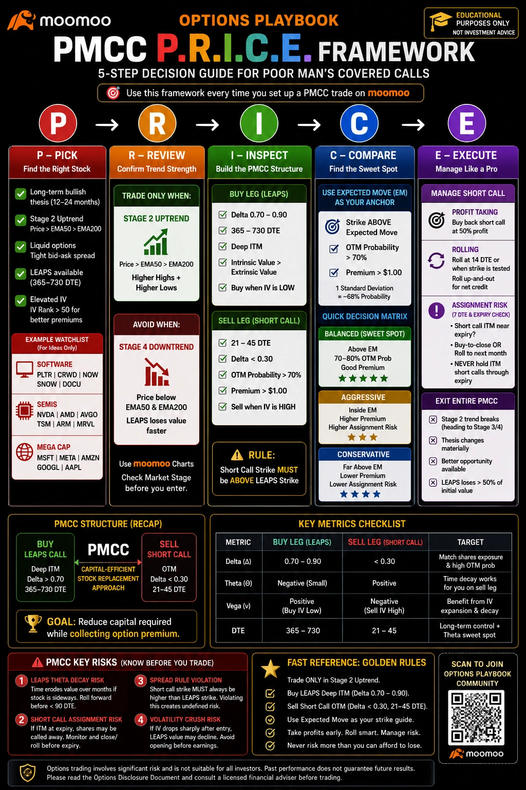
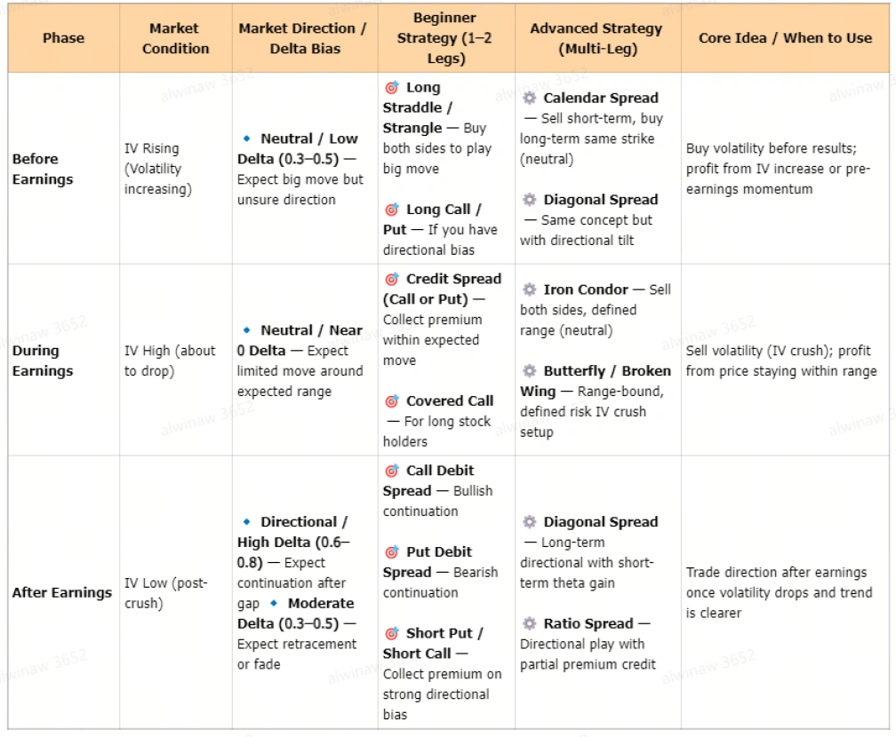

# 📚 The Complete Option Playbook: Ultimate Masterclass Guide

Based on the [Masterclass Guide](https://www.moomoo.com/community/feed/the-complete-option-playbook-your-ultimate-masterclass-guide-116959167184902) (by the [Options Playbook Profile](https://www.moomoo.com/community/profile/options-playbook-106809606)) and its associated chapter links, the Option Playbook series is a comprehensive 10-chapter curriculum designed to transition traders away from guessing market direction to using a **probability and data-driven approach** for managing risk and structuring trades. 

> [!NOTE]
> The individual chapter links point directly to the **Live Webinar Replay** videos rather than written articles. Since we cannot directly transcribe the hours of video content, this summary breaks down the core focus and strategic intent of each chapter based on the playbook's curriculum and the detailed recap posts.

### 🔗 Related Live Webinar Recaps & Supplementary Guides
- [Market Turning Risk-Off? Worry of Market Crash? Try This...](https://www.moomoo.com/community/feed/market-turning-risk-off-worry-of-market-crash-try-this-115576143020038)
- [03/02/2026 Live Webinar Recap: '0DTE' Goes Midweek](https://www.moomoo.com/community/feed/03-02-2026-live-webinar-recap-0dte-goes-midweek-for-116007006699526)
- [20/01/2026 Live Webinar Recap: Jan-Feb 2026 Mag7 and Beyond](https://www.moomoo.com/community/feed/20-01-2026-live-recap-jan-feb-2026-mag7-and-115937653751814)
- [FREE DOWNLOAD OPTION TRADING 101 GUIDES](https://www.moomoo.com/community/feed/free-download-option-trading-101-guides-trading-options-for-dummies-115338025435142)
- [The Options Playbook You've Been Waiting For: My Full Step-by-Step Guide](https://www.moomoo.com/community/feed/the-options-playbook-you-ve-been-waiting-for-my-full-115298917023750)
- [Ultimate Guide: Trading Options Before, During & After Earnings](https://www.moomoo.com/community/feed/ultimate-guide-trading-options-before-during-after-earnings-options-earnings-115417291882502)

---

## Part 0: Pre-Read Options Basics Cheat Sheet
*A quick reference guide for essential options vocabulary and rules before diving into the core strategies.*

### 🗝️ Key Vocabulary & Analogies
- **Call Option:** Right to BUY shares at a fixed price. *Analogy: Booking a hotel at today's price—you can cancel, but the price is locked.*
- **Put Option:** Right to SELL shares at a fixed price. *Analogy: Insurance—pays you if things go bad past a certain point.*
- **Premium:** The fee paid upfront (max loss for buyers). *Analogy: Non-refundable booking fee.*
- **ITM / OTM:** In-The-Money (has value now) vs. Out-Of-The-Money (no value yet).
- **Delta:** How much the option price moves when the stock moves $1.
- **Theta:** Time decay; option loses value daily. *Analogy: Fresh food spoiling over time.*
- **Implied Volatility (IV):** Expected market movement. High IV = big expected moves; Low IV = calm.
- **IV Rank:** Whether options are expensive or cheap compared to recent history.

### 🧭 Strategy Selection Guide (Based on IV Environment)
- **LOW IV Rank (< 30):** Options are cheap (e.g., pre-earnings). *Preferred: Long Call, Long Put, Debit Spread.*
- **MEDIUM IV Rank (30–60):** Neutral pricing. *Preferred: Debit Spread.*
- **HIGH IV Rank (> 60):** Options are expensive (e.g., post-earnings IV crush). Good to sell premium. *Preferred: Credit Spread.*

### 🛡️ Golden Rules for Beginners
1. Never risk money you cannot afford to lose entirely.
2. Always know your maximum loss before you enter.
3. Start small. Give your trade enough time (avoid expiry dates that are too close).
4. Take profit early, cut losses early.
5. When IV is high, options are expensive—be extra careful.

---

## Part 1: The Core Foundations
*The first section focuses on building a solid ground-up understanding of options mechanics, focusing on data and probability before moving to complex setups.*

### 📍 [Chapter 1: Navigating Options with Moomoo](https://www.moomoo.com/community/feed/navigating-options-with-moomoo-116216052908038)
- **Focus:** Introduction to the Moomoo platform's options interface and the foundational basics of options trading.
- **Strategy:** Understanding how to read the options chain, basic terminology, and setting up your workspace for probability-based trading.

### 📍 [Chapter 2: The Two Sides of the Trade: Buyers vs. Sellers](https://www.moomoo.com/community/feed/the-two-sides-of-the-trade-buyers-vs-sellers-116295342358534)
- **Focus:** The fundamental dynamics of the options market.
- **Strategy:** Exploring the risk/reward differences between buying options (paying a premium for leverage/defined risk) and selling options (collecting a premium for taking on obligation and utilizing time decay).
- **Core Comparison (Which side are you on?):**
  - **Buyer (Long Call/Put):** Pays premium. Defined risk (= premium). Max gain is large/asymmetric. Win rate is low. Time decay (theta) is the enemy. Long vega (wants IV to rise). Needs a fast, real directional move.
  - **Seller (Short Put/Call/Spreads):** Collects premium. Risk is larger/undefined (or defined w/ spreads). Max gain is capped at credit. Win rate is high. Time decay (theta) is a friend. Short vega (wants IV to fall). Needs price to stay away from the strike.

---

## Part 2: Income Generation & Equity Acquisition
*This section shifts into utilizing options to generate consistent yield and acquire stock at a discount.*

- **The Barbell Strategy (Core Concept):** Allocating 80% of your portfolio to core blue-chip stocks/ETFs for long-term growth, and 20% to options selling (like CSPs and CCs) for recurring income.
- **Moomoo's Seller Dashboard (5-Step Cheatsheet):** A key tool used to identify and filter short setups. 
  1. **Prepare Watchlist:** Filter for IV Rank ≥ 50, IV Percentile ≥ 60.
  2. **Review Technicals:** Align with Market Stage (Stage 2 Uptrend = CSP, Stage 3 = Caution, Stage 4 = Manage Risk).
  3. **Inspect Dashboard:** Target 30-45 DTE and OTM Probability ≥ 70%.
  4. **Configure Trades:** Review P/L analysis, breakevens, and assignment scenarios.
  5. **Execute with Discipline:** Use limit orders and strictly follow exit rules.

### 📍 [Chapter 3: Get Income While Holding Stocks](https://www.moomoo.com/community/feed/get-income-while-holding-stocks-116374851551238)
- **Strategy (Covered Calls):** Selling call options against stock you already own. This generates additional income (yield) while you hold the underlying asset, effectively lowering your cost basis over time.
- **Execution Rules:**
  - Sell ~0.20–0.30 delta OTM call, 30–45 DTE.
  - Only execute on a stock you're willing to have called away.
  - Take profit (buy back or roll) at ~50% of the credit captured.

### 📍 [Chapter 4: Get Paid to Buy: Turning Patience into Income](https://www.moomoo.com/community/feed/get-paid-to-buy-turning-patience-into-income-116453878005766) | [Recap](https://www.moomoo.com/community/feed/options-playbook-webinar-recap-seller-dashboard-for-cash-secure-puts-116604515910438)

- **Strategy (Cash-Secured Puts):** Selling put options on stocks you want to own at a specific, lower price. You collect a premium while waiting for the stock to drop to your desired entry point. If it never drops, you keep the premium as pure income.
- **Execution Rules:**
  - **Structure:** Sell 0.20–0.30 delta put on a name you'd happily own.
  - **DTE:** Target 30–45 days for optimal premium decay, or a shorter 7–14 day window for a quicker turnaround.
  - **Rules:** Cash secured = strike × 100 set aside per contract. Only sell on stocks you want to own; pick your happy price.
  - **Trade Management:** Take profit at ~50% of credit; manage/roll near assignment.

### 📍 [Chapter 5: The Wheel Strategy - Building a Repeatable Income System](https://www.moomoo.com/community/feed/the-wheel-strategy-building-a-repeatable-income-system-116533157822470)

- **Strategy (The Wheel):** A popular mechanical cycle that combines Chapters 3 & 4 into a systematic way to lower your break-even price and generate consistent income through repeated premium collection.
  1. Sell Cash-Secured Puts (Ch 4) to collect income until assigned the stock.
  2. Once assigned, sell Covered Calls (Ch 3) against the stock to collect more income until the stock is called away.
  3. Repeat the cycle.
- **Execution Rules:** A repeatable income state machine. Follow the exact same Delta, DTE, and 50% Take Profit rules defined in Chapters 3 & 4.

---

## Part 3: Advanced Capital Efficiency & Spreads
*The final technical section moves into multi-leg setups (spreads) and highly leveraged directional plays.*

### 📍 [Chapter 6: LEAPS into Long-Term Growth with Less Capital](https://www.moomoo.com/community/feed/leaps-into-long-term-growth-with-less-capital-116612416798726) | [Recap](https://www.moomoo.com/community/feed/the-option-playbook-chapter-6-recap-116639509315590)

- **Strategy (LEAPS):** The smart "Rent-to-Own" strategy. Using Long-Term Equity Anticipation Securities (options expiring in 1+ years) as a substitute for stock ownership. 
- **Benefits:** It provides maximum capital efficiency, requiring significantly less capital than buying 100 shares outright. This grants powerful leverage for long-term equity growth while maintaining strictly defined risk.
- *Analogy:* The "Rent-to-Own" Concept.
- **Execution Rules:**
  - Buy a Long call with > 1 year to expiry, deep ITM (~0.70–0.80 delta) as a lower-capital stock substitute.
  - Mostly discretionary and thesis-driven; weak fit for full automation.

### 📍 [Chapter 7: Credit Spread - Defined Risk Income Without Owning Stocks](https://www.moomoo.com/community/feed/credit-spread-defined-risk-income-without-owning-stocks-116691691896838) | [Recap](https://www.moomoo.com/community/feed/7-04-2026-options-landlord-playbook-webinar-recap-credit-spreads-116363913069350)

- **Strategy:** The "Income with a Safety Net" strategy. It involves selling an option while simultaneously buying a further out-of-the-money option to cap losses. This allows traders to generate consistent yield by being the "seller" while strictly defining their maximum risk, without needing the large capital required to hold 100 shares.
- *Analogy:* The "Options Landlord" / "Insurance Company" Analogy - collecting premium like rent (profiting from time decay and IV drop), but buying a cheaper policy further out to protect yourself from a catastrophic payout.
- **The Landlord Playbook & PRICE Framework:** Designed for volatile markets. Covers three spread types: Put Credit Spread, Call Credit Spread, and Iron Condor.
- **Execution Rules:**
  - **Structure:** Sell 0.15–0.30 delta short leg, buy further-OTM long leg, using 7–14 or 30–45 DTE cycles.
  - **Entry Signals (14-period Daily RSI):** 
    - *Iron Condor:* RSI 45–55 (Neutral)
    - *Put Credit Spread:* RSI crossing above 30 (Oversold bounce)
    - *Call Credit Spread:* RSI crossing below 70 (Overbought rejection)
  - **Strike Selection:** Set strikes at the 1 Standard Deviation (SD) Expected Move boundary.
  - **Trade Management:** Predefined max loss = width − credit. Set a 50% take-profit exit rule immediately after entry. Never hold into the final hours of expiration (Pin Risk).

### 📍 [Chapter 8: Debit Spread - Trading Direction Without Overpaying](https://www.moomoo.com/community/feed/debit-spread-trading-direction-without-overpaying-116770966142982) | [Recap](https://www.moomoo.com/community/feed/options-breakout-playbook-webinar-recap-bull-call-spread-in-5-116442962722822)

- **Strategy (Bull Call Spread):** The "Directional Conviction Without Overpaying" strategy. By pairing a long option (buying a lower-strike call) with a short option (selling a higher-strike call), you reduce the overall cost of the trade. Defined risk = net debit paid; defined reward = spread width minus net debit.
- *Analogy:* The "Subsidized Ticket" Analogy - you want the expensive VIP ticket (the long option), but you sell your extra backstage pass (the short option) to someone else to subsidize the cost of your entry.
- **The Breakout Playbook & PRICE Framework:** This strategy is ideal for trading breakouts near 52-week highs (backed by Minervini VCP research).
- **Execution Rules:** 
  - **Structure:** Buy ATM/ITM long leg (the "Engine") + sell OTM short leg (the "Subsidy"). Ensure spread is ≥ $0.50 wide to beat slippage.
  - **DTE:** Target 30–45 DTE for a balanced theta shield, or short DTE for a specific catalyst.
  - **Environment:** Ideal in Low-IV environments (cheaper premium and potential for Vega expansion).
  - **Trade Management:** Exit at 50–80% of max profit. If it's a loser, close early or accept net-debit max loss.
  - **The Twins Rule:** *Never leg out.* Never close the profitable leg and leave the loser open; always open and close both legs simultaneously.

### 📍 [Chapter 9: Long Call/Put - Big Moves with Small Capital](https://www.moomoo.com/community/feed/long-call-put-big-moves-with-small-capital-116850239143942)

- **Strategy:** The "Big Moves with Small Capital" strategy. Expressing aggressive directional conviction with strictly defined risk (you never lose more than the premium paid) and powerful leverage.
- *Analogy:* Considered the "Booking Fee".
- **Execution Rules:**
  - **Structure:** Select strike at 0.45–0.60 delta (ATM/slightly OTM) with 14–45 DTE. Avoid far-OTM strikes.
  - **Environment:** Buy when IV is LOW ("The Flood Rule": buy before the storm, not during it). Strongly avoid pre-earnings to prevent IV crush.
  - **Trade Management:** Fast win → take profit immediately. Slow loss → salvage remaining premium or accept the loss. Avoid averaging down.

### 📍 [Bonus Chapter: Mastering Poor Man's Covered Call (PMCC)](https://www.moomoo.com/community/feed/options-playbook-webinar-recap-mastering-poor-man-s-covered-call-116723902185478)

- **Strategy (PMCC):** A capital-efficient alternative to traditional covered calls. Instead of buying 100 shares of stock, you buy a deep ITM LEAPS call as a "stock substitute" and sell short-dated OTM calls against it. 
- **Benefits:** Requires significantly less capital than buying 100 shares, defines max risk to the net debit paid, generates monthly income, and maintains long-term upside exposure.
- **The P.R.I.C.E Execution Framework (5-Step Decision Guide):**
  - **P (Pick):** Pick high-liquidity stocks with a long-term bullish thesis (12-24 months), in a Stage 2 Uptrend (Price > EMA50 > EMA200). Target IV Rank > 50 for better short leg premiums.
  - **R (Review):** Confirm trend strength (Higher Highs + Higher Lows). Never trade in a Stage 4 Downtrend where LEAPS lose value quickly.
  - **I (Inspect):** Build the PMCC Structure. 
    - **Buy Leg (LEAPS):** 0.70–0.90 Delta, 365–730 DTE, Deep ITM. Buy when IV is LOW.
    - **Sell Leg (Short Call):** <0.30 Delta, 21–45 DTE, >70% OTM Prob, Premium >$1.00. Sell when IV is HIGH.
    - **Crucial Rule:** Short Call Strike MUST be ABOVE LEAPS Strike.
  - **C (Compare):** Find the Sweet Spot using the Expected Move (EM) as your anchor. The "Balanced" setup is striking just *above* the EM (~1 Standard Deviation / 68% probability).
  - **E (Execute):** Manage Like a Pro.
    - **Short Call:** Buy back at 50% profit. Roll at 14 DTE or when strike is tested (Roll up-and-out for net credit).
    - **Exit Entire PMCC:** If the Stage 2 trend breaks, the macro thesis materially changes, or the LEAPS loses >50% of initial value.

---

### 📍 [Bonus Chapter: Market Turning Risk-Off (H.E.A.T. System)](https://www.moomoo.com/community/feed/market-turning-risk-off-worry-of-market-crash-try-this-115576143020038)
- **Strategy:** Proactively rotating into defensive sectors during market corrections rather than just moving to cash.
- **The H.E.A.T. Execution Framework:**
  - **H (Hunt With Heatmap):** Finding the green spots (defensive sectors like Staples, Utilities, Healthcare) in a sea of red.
  - **E (Edge Stack):** Filtering for fundamental (low P/E), technical (relative strength/uptrend against the market), and options edge (elevated IV).
  - **A (Action):** Executing income strategies (like Cash-Secured Puts) on these defensive names to capture elevated premiums.
  - **T (Track & Tune):** Managing the trade and taking profits at predefined targets (e.g., +50%).

### 📍 [Bonus Chapter: Ultimate Guide to Earnings & IV Crush](https://www.moomoo.com/community/feed/ultimate-guide-trading-options-before-during-after-earnings-options-earnings-115417291882502) | [Recap](https://www.moomoo.com/community/feed/earnings-options-playbook-webinar-recap-iv-crush-in-4-simple-116284422684678)

- **Strategy:** A structured playbook to trade volatility (IV) expansions and contractions around corporate earnings.
- **The 4-Step IV Crush Filter (Finding the Edge):**
  1. **IV Level:** Is it elevated near its peak? (IV Percentile > 70% = Options are expensive, good to sell).
  2. **Consistent Crush:** Does it crush reliably? (Look for a repeatable edge in past periods).
  3. **Double Digit Crush:** Is the drop big enough to profit? (Avg historical crush > 10% is ideal).
  4. **Implied vs Expected:** Is the premium rich? (Implied Move MORE than historical expected move = Market is overpricing options).
- **Phase 1: Before Earnings (IV Rising)**
  - **Market Condition:** IV is increasing as uncertainty builds.
  - **Bias:** Neutral / Low Delta (0.3–0.5). Expecting a big move but unsure of direction.
  - **Beginner Strategy:** Long Straddle / Strangle (buy both sides) or Long Call/Put (if directional bias exists).
  - **Advanced Strategy:** Calendar Spread or Diagonal Spread.
  - **Core Idea:** Buy volatility *before* results. Profit from IV increase and pre-earnings momentum.
- **Phase 2: During Earnings (IV High, about to drop)**
  - **Market Condition:** IV is at its peak and will crush immediately after the announcement.
  - **Bias:** Neutral / Near 0 Delta. Expecting limited move around the expected range.
  - **Beginner Strategy:** Credit Spread (Call/Put) to collect premium, or Covered Call.
  - **Advanced Strategy:** Iron Condor or Butterfly / Broken Wing.
  - **Core Idea:** Sell volatility (IV Crush). Profit from the price staying within the implied expected range.
- **Phase 3: After Earnings (IV Low, post-crush)**
  - **Market Condition:** IV has collapsed. 
  - **Bias:** Directional / High Delta (0.6–0.8) for gap continuation, or Moderate Delta (0.3–0.5) for fade/retracement.
  - **Beginner Strategy:** Call/Put Debit Spreads (for continuation) or Short Put/Call (if strong directional bias).
  - **Advanced Strategy:** Diagonal Spread or Ratio Spread.
  - **Core Idea:** Trade pure direction *after* the event once volatility has dropped and the new trend is clear. Do NOT hold to expiry hoping for more—the edge (IV crush) is already realized.

---

## Part 4: Conclusion
### 📍 [Final Chapter: The Art of Trade Management & Rolling](https://www.moomoo.com/community/feed/the-art-of-trade-management-116929516732422)
- **Focus:** Execution, adjustment, and risk management.
- **Strategy:** How to read the Greeks (Delta, Theta, Vega, Gamma) before entering a trade, how to manage positions when they go wrong, and understanding major risks like Theta Decay (time decay) and IV Crush (implied volatility collapse).
- **The 4 Rules of Rolling (Closing a position and opening a new one simultaneously):**
  - **Rolling Out (Time):** Price within 1 SD, but close to expiration. Roll to a later date at the same strike to let Theta work or wait for a reversal.
  - **Rolling Down (Credit Spread):** Price testing your Short Put strike. Roll to a lower strike (further OTM) to move your "Safety Line" and avoid assignment.
  - **Rolling Up (Winning Trade):** Stock moved significantly in your favor. Roll closer to the current price to lock in profits and set up a new target.
  - **Rolling for a Credit:** IV rises. Roll further out in time for a higher premium than the cost to close.
- **Execution Rules (The Golden Rules of Management):**
  - Plan your exits *before* entry.
  - Take profits aggressively at your target (e.g., 50%).
  - Never average down on losing options positions.
  - Theta accelerates dramatically in the final ~30 days, so prioritize time-based exits when holding short-term plays.

